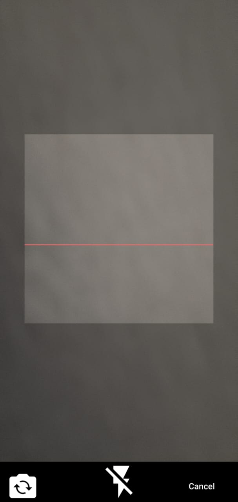

# 📲 QR Code Scanner & Generator App

A Flutter application that allows users to scan QR codes using the device's camera and generate custom QR codes for text, links, and more.

---

## 🚀 Features

- 🔍 Scan QR codes using the camera
- 🧾 Generate QR codes for any text or URL
- 🖼 Save generated QR code as an image
- 📤 Share QR codes directly from the app
- 🧰 Clean and responsive UI

---

## 📸 Screenshots

| Scanner                               | Generator                                 |
|---------------------------------------|-------------------------------------------|
|  |  |


---

## 🛠 Installation

Make sure you have Flutter installed. Then run:

```bash
git clone https://github.com/yourusername/qr-code-scanner-generator.git
cd qr-code-scanner-generator
flutter pub get
flutter run
